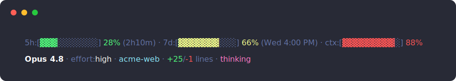

# claude-code-statusline

A colored status line for [Claude Code](https://code.claude.com). The usage meters change
color as they fill up, so a glance tells you how much rate limit and context you have left.



Line 1 is your usage; line 2 is what you're working on. Both hide any field that isn't
relevant right now.

## Install

You need [`jq`](https://jqlang.github.io/jq/) and `bash` (macOS's built-in `bash` 3.2 works —
nothing to build or compile).

1. Clone it anywhere:

   ```sh
   git clone https://github.com/vaichidrewar/claude-code-statusline.git
   ```

2. Add this to `~/.claude/settings.json`, using the full path to where you cloned it:

   ```json
   "statusLine": {
     "type": "command",
     "command": "bash /path/to/claude-code-statusline/statusline-command.sh"
   }
   ```

Start a new Claude Code session and it shows up. That's it.

## What the meters mean

**Line 1 — how much you have left.** Each bar goes **green → yellow → red** as it fills
(green under 50%, yellow 50–79%, red 80%+):

- **`5h` / `7d`** — your Claude usage limits for the 5-hour and 7-day windows, with the time
  until each one resets.
- **`ctx`** — how full the current context window is.

**Line 2 — what you're doing.** Model, reasoning effort, subagent name, project folder,
uncommitted git changes (`+added`/`-removed`), and whether extended thinking is on. Fields
that don't apply are simply left out.

## Customizing the colors

All the colors live in one block near the top of `statusline-command.sh` (`RED`, `GREEN`,
`CYAN`, …) as ANSI escape codes. Change those and re-open Claude Code. The green/yellow/red
thresholds are in the `sev_color` function just below.

## Development

`./test-samples.sh` feeds the script a set of example inputs (including the tricky ones — 0%,
100%, missing meters, running as a subagent) and prints the result. Run it after any change
and check the output looks right.

<details>
<summary>Why it's built the way it is</summary>

- **Two lines, meters first.** A single line overflowed and truncated the context bar off
  the right edge. Meters lead so that if the terminal ever cuts off the end, you lose
  trailing metadata, not your usage bars.
- **Shade glyphs (`▓`/`░`), not solid blocks.** The block characters (`█`) render at a
  slightly different height than the shade characters, so filled cells sat visibly higher
  than empty ones. Staying in one glyph family keeps the bar flat.
- **Any nonzero usage fills at least one cell.** Rounding alone showed 3–5% as an empty bar,
  which reads as "nothing's happening" instead of "a little."
- **`bash` 3.2 compatible.** That's what macOS ships and what Claude Code runs the script
  with, so no `local -n`, `${var,,}`, or other 4.x-only features.

</details>

## License

MIT — see [LICENSE](LICENSE).
